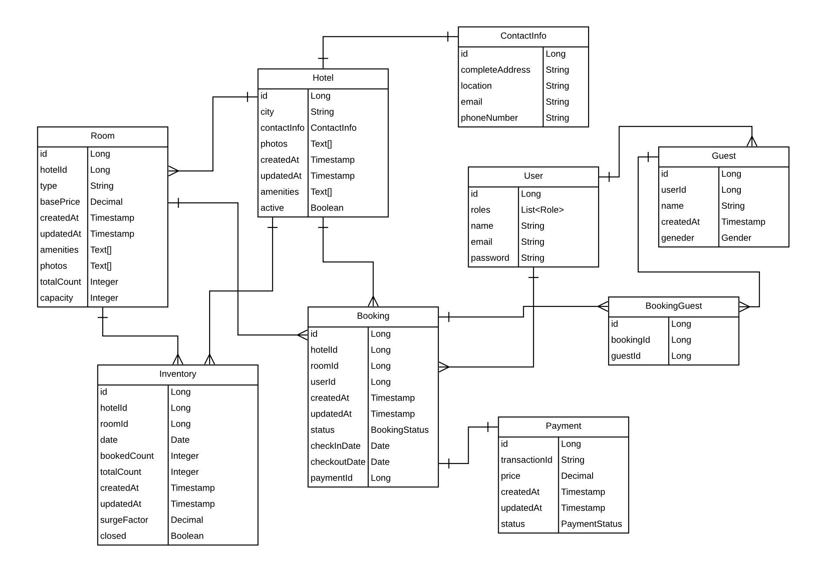
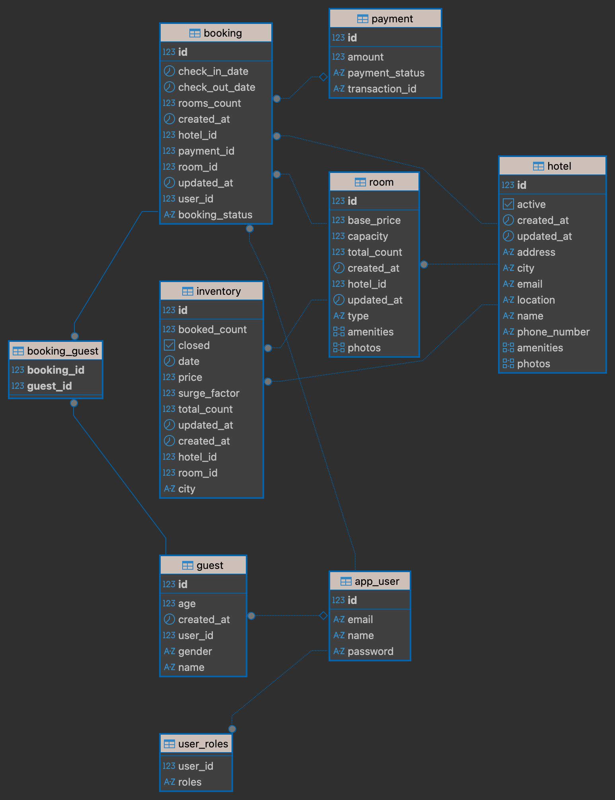
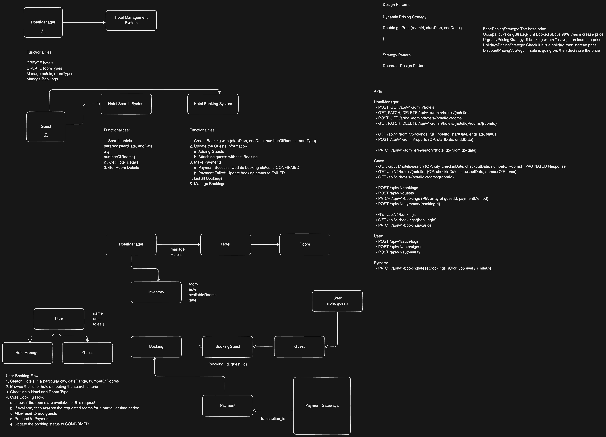

# 🏨 AirBnB Backend (Spring Boot + PostgreSQL)

A backend system that mimics the core functionality of Airbnb: managing hotels, rooms, bookings, guests, inventory, and payments.

---

## ⚡ Features (Implemented)

- **Hotel & Room management**
- **Guest management**
- **User authentication with roles** (`HotelManager`, `Guest`)
- **Booking system** with guests and payments
- **Inventory tracking** with surge pricing
- **Payment integration** (Transaction ID & Status)
- **Enum-based Role & Status management**
- **Dynamic Pricing Engine(Strategy Pattern):**
  - **Base Pricing**
  - **Surge Pricing**
  - **Occupancy-based Pricing**
  - **Urgency-based Pricing**
  - **Holiday Pricing**
- **Scheduled Price Updates:**
  - **Re-calculates inventory prices every hour**
  - **Updates minimum hotel price (per day) for faster search**

---

## 📐 System Design

### Data Flow Diagram (DFD)


### Database View (DBeaver)


### High-Level Architecture


---

## 🛠 Tech Stack

- **Backend:** Spring Boot
- **ORM:** JPA / Hibernate
- **Database:** PostgreSQL
- **Utilities:** Lombok
- **Build Tool:** Maven

---

## 🗂 Controllers & Endpoints

### Hotel Management (Admin)
`/admin/hotels`
- `POST /` → Create new hotel
- `GET /` → Get all hotels
- `GET /{hotelId}` → Get hotel by ID
- `PUT /{hotelId}` → Update hotel
- `DELETE /{hotelId}` → Delete hotel
- `PATCH /{hotelId}/activate` → Activate hotel

### Room Management (Admin)
`/admin/hotels/{hotelId}/rooms`
- `POST /` → Create new room
- `GET /` → Get all rooms in a hotel
- `GET /{roomId}` → Get room by ID
- `DELETE /{roomId}` → Delete room

### Hotel Browsing
`/hotels`
- `GET /search` → Search hotels with filters
- `GET /{hotelId}/info` → Get detailed hotel info

### Booking
`/bookings`
- `POST /init` → Initialise a new booking
- `POST /{bookingId}/addGuests` → Add guests to a booking

---

## ⚙️ Setup Guide

1. **Clone the repository**
   ```bash
   git clone https://github.com/RightMeProve/airBnbApp.git
   cd airBnbApp
   ```

2. **Configure Database**  
   Edit `src/main/resources/application.properties`:
   ```properties
   spring.datasource.url=jdbc:postgresql://localhost:5432/airbnb
   spring.datasource.username=postgres
   spring.datasource.password=yourpassword
   spring.jpa.hibernate.ddl-auto=update
   spring.jpa.show-sql=true
   ```

3. **Run the application**
   ```bash
   ./mvnw spring-boot:run
   ```

---

## 📂 Project Roadmap

1. ✅ Project setup & dependencies
2. ✅ Configure database connection
3. ✅ Define entities & relationships
4. ✅ Implement repositories & services
5. ✅ Add REST controllers & APIs
6. ✅ Implement dynamic pricing strategies (Strategy Pattern)
7. ✅ Add scheduled pricing updates (hourly)
8. ⬜ Integrate authentication & JWT
9. ⬜ Implement business rules (inventory reset job)
8. ⬜ Deploy locally → containerize with Docker

---

## 👨‍💻 Author

- **Satyam Kumar** [@RightMeProve](https://github.com/RightMeProve)

